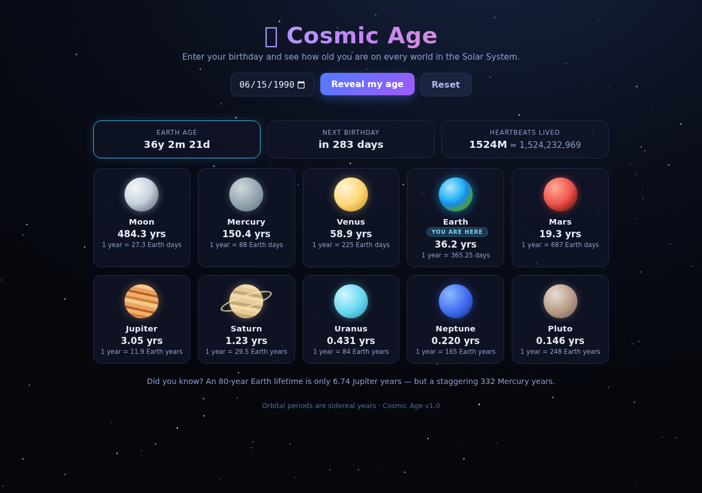

# 🌌 Cosmic Age

**Your age across the Solar System.** Enter your birthday and see how old you are on the Moon and all eight planets plus Pluto — where a "year" ranges from 88 Earth days (Mercury) to 248 Earth years (Pluto).

Cosmic Age is a single-file, dependency-free web app (one `index.html`, zero CDN, zero build step) that scales your Earth age by each world's **sidereal orbital period**, so you can watch your age balloon on the slow outer planets and shrink on the fast inner ones.



## What it does

- **Exact Earth age** in years / months / days, computed from the calendar date (day-of-month aware).
- **Age on 10 celestial bodies**, each scaled by its real sidereal orbital period (Earth years).
- **Next-birthday countdown** ("It's today! 🎉" when it arrives) and a fun **"heartbeats lived"** stat.
- **Animated starfield** on a `<canvas>` plus CSS-drawn planets (Saturn even has a ring).
- **Birthdate saved to `localStorage`** and restored on reload.

## Celestial bodies

Age is `Earth years ÷ orbital period` for each world. Periods are sidereal years, identical to the constants used in the app's source and test suite:

| Body | 1 year = | Age factor (≈) |
|------|----------|----------------|
| ☾ Moon | 27.3 Earth days | × 13.4 (≈ 13.4 yr / Earth yr) |
| ☿ Mercury | 88 Earth days | × 4.15 |
| ♀ Venus | 225 Earth days | × 1.63 |
| 🌍 Earth | 365.25 days | × 1.00 |
| ♂ Mars | 687 Earth days | × 0.53 |
| ♃ Jupiter | 11.9 Earth years | × 0.084 |
| ♄ Saturn | 29.5 Earth years | × 0.034 |
| ♅ Uranus | 84 Earth years | × 0.012 |
| ♆ Neptune | 165 Earth years | × 0.0061 |
| ♇ Pluto | 248 Earth years | × 0.0040 |

Age values render at a smart precision (`humanizeAge`): **3 decimals** below 1 year, **2 decimals** below 10 years, **1 decimal** above — so a newborn's Earth age on Pluto shows as `0.146 yrs` rather than a wall of zeros.

## How it works

- **Year length** is the Julian year `365.2425` days — so `ageYears = (now − birth) / (365.2425 × 86 400 000 ms)`.
- **Heartbeats** assume a steady **80 beats per minute**: `ageYears × 365.2425 × 24 × 60 × 80` (≈ 1.52 billion for a 36-year-old), shown as e.g. `1.52B` with the exact figure in the tooltip.
- **Fun fact** (code-verified): an 80-year Earth lifetime is only **≈ 6.7 Jupiter years** — but a staggering **≈ 332 Mercury years**.
- **Persistence** is via the `localStorage` key **`cosmicAgeBirth`**; **Reset** clears both the input and that key and returns to the empty state.

## How to run

The app is fully self-contained — no build, no dependencies, no network. Either:

```bash
# Option A — open directly (works from file:// because there are zero external resources)
open index.html

# Option B — serve the repo directory
python3 -m http.server 8765 --directory .
# then open http://localhost:8765
```

## Run the tests

The repo ships a bundled **Playwright** suite (`test.js`) that drives the real UI headlessly — filling the date input, clicking the buttons, reload-persisting state, and asserting every computed age against independently re-derived values.

```bash
npm install                 # installs Playwright (or use a global install)
npm run test                # runs node test.js → expects the app on :8765
```

Prerequisites/notes:

- The server must already be running on `http://localhost:8765` (or point the suite elsewhere with `BASE_URL=https://your-deploy ... npm test`).
- Chromium must be installed once: `npx playwright install chromium`.
- The suite saves screenshots to `/tmp/daily-app/` (create it or the screenshot steps fail) — this is the test's own scratch dir, *not* the app directory.

### Test status — honest current state

The suite runs **43 assertions: 42 passing, 1 pre-existing failure**. The single failure is a **date-dependent hardcoded literal** in the test: it asserts the Earth stat equals exactly `36y 2m 3d`, but the true value depends on the current date (on the day of this run it's `36y 2m 21d`). The equivalent assertion that **recomputes** the Y/M/D independently passes, so the app logic is correct — the hardcoded literal will drift one day behind unless the test is updated to use the recomputed value.

### `window.__app` test hook API

For scripting/QA, the app exposes a small programmatic API on `window.__app`:

| Property | Returns |
|----------|---------|
| `PERIODS` | Array of `{ id, name, period }` for all 10 bodies |
| `getState()` | Snapshot of the current state (birth, YMD, next-birthday, heartbeats, all ages) |
| `setBirth(iso)` | Set a birth date (`YYYY-MM-DD`) and recompute; returns the new state |
| `reset()` | Reset the app; returns the new (empty) state |

## Project structure

```
.
├── index.html   # the entire app (HTML + CSS + JS), ~320 lines
├── test.js      # Playwright end-to-end test suite (43 assertions)
├── package.json # start + test scripts
└── .gitignore
```

## License

No `LICENSE` file is present, and `package.json` declares no `license` field — the project is **all-rights-reserved by default**. No license badge is shown because none is real. (Only neutral, always-truthful shields are used below.)

[](https://github.com/chaitanyame/daily-app-cosmic-age)
[](https://github.com/chaitanyame/daily-app-cosmic-age)